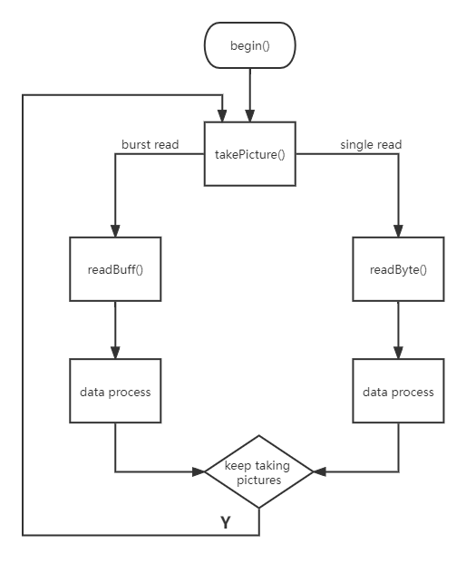
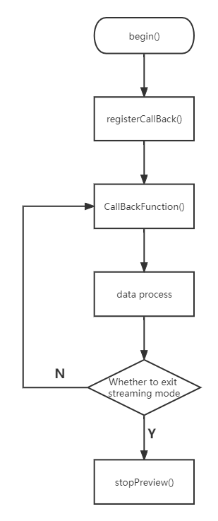

## setup()
```
myUart.arducamUartBegin(921600);
myCAM.begin();
myCAM.registerCallBack(readBuffer,200);
```

### Initialize serial communication
Initialize serial communication, used for communication of Arducam Mega software.

## Initialize the camera
Use the begin() function to initialize the camera configuration.After this function runs, the camera will be configured as JPEG data format and the resolution will be the maximum.

Function prototype:

`CamStatus begin(ArducamCamera* camera);`


### Register callback function
Register the callback function. This function will be called in streaming mode.

Function prototype:

`void registerCallback(ArducamCamera* camera, BUFFER_CALLBACK function, uint8_t blockSize);`

Warning:  Transmission length should be less than 255

### loop()
In the loop, it follows the specific protocol Arducam defined to parse command sent by Arducam Mega host and do specific operation to response each command. The detail script is here:

Serial data receiving  
```
if (myUart.arducamUartAvailable())
{
    temp = myUart.arducamUartRead();
    arducamDelayMs(5);
    if (temp == 0x55)
    {
        while (myUart.arducamUartAvailable())
        {
        commandBuff[commandLength] = myUart.arducamUartRead();
        if (commandBuff[commandLength] == 0xAA)
        {
            break;
        }
        commandLength++;
        }
        myUart.uartCommandProcessing(&(myCAM.cameraInfo),commandBuff,commandLength);
        commandLength = 0;
    }
}
```

### Protocol analysis

```
uint8_t ArducamLink::uartCommandProcessing(Arducam* myCAM,uint8_t* commandBuff)
{
    ArducamCamera* cameraInstance = myCAM->getCameraInstance();
    CamStatus state;
    uint16_t gainValue = 0;
    uint32_t exposureValue = 0;
    uint32_t exposureLen1 = 0;
    uint32_t exposureLen2 = 0;
    uint32_t exposureLen3 = 0;

    uint8_t cameraResolution = cameraInstance->currentPictureMode;
    uint8_t cameraFarmat = cameraInstance->currentPixelFormat;
    switch (commandBuff[0])
    {
        case SET_PICTURE_RESOLUTION:                                                                          //Set Camera Resolution
            cameraResolution = commandBuff[1] & 0x0f;
            cameraFarmat = (commandBuff[1] & 0x70) >> 4;
            myCAM->takePicture((CAM_IMAGE_MODE)cameraResolution,(CAM_IMAGE_PIX_FMT)cameraFarmat);
            break;
        case SET_VIDEO_RESOLUTION:                                                                            //Set Video Resolution
            cameraResolution = commandBuff[1] & 0x0f;
            state = myCAM->startPreview((CAM_VIDEO_MODE)cameraResolution);
            if (state == CAM_ERR_NO_CALLBACK)
            {
                Serial.println("callback function is not registered");
            }
            break;
        case SET_BRIGHTNESS:                                                                                  //Set brightness
            myCAM->setBrightness((CAM_BRIGHTNESS_LEVEL)commandBuff[1]);
            break;
        case SET_CONTRAST:                                                                                    //Set Contrast
            myCAM->setContrast((CAM_CONTRAST_LEVEL)commandBuff[1]);
            break;
    ..............

    ```

    ## Flow Charts

    ### take pictures

    

    ### streaming mode

    